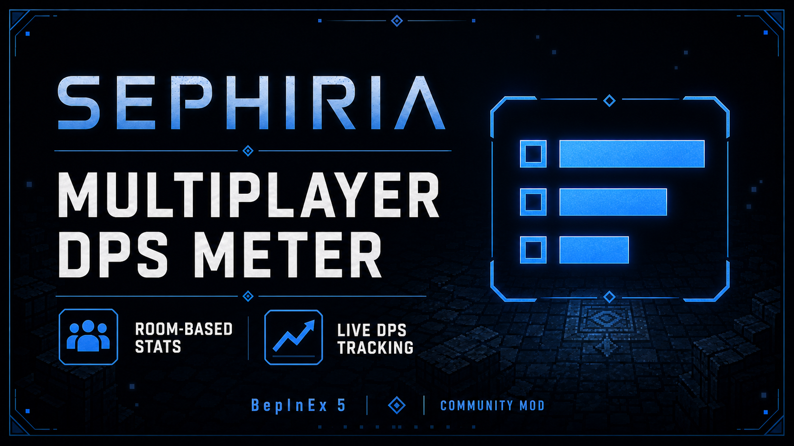

🌐 语言 / Language：[简体中文](README.md) · [English](README.en.md)

[](https://github.com/G-Yoka/SephiriaDpsMeter/releases/latest)
[](https://github.com/G-Yoka/SephiriaDpsMeter/releases)



A **BepInEx 5** damage meter for Sephiria. Track player damage, DPS and damage share for the current battle room in a movable, scalable overlay. Supports single-player and multiplayer sessions.

- Current version: `v1.5.1`.
- Steam AppID: [2436940](https://store.steampowered.com/app/2436940/Sephiria/).
- Environment: Windows / BepInEx 5 / Unity Mono.
- Compatibility: `v1.5.1` passed compilation, automated checks and in-game testing on 2026-08-28. Game updates may require compatibility checks.
- Multiplayer: reads the game's native Mirror damage feedback on the host or client.

> This is a **BepInEx 5** plugin, not a BepInEx 6 or IL2CPP plugin. Do not overwrite your existing loader with an unrelated mod's complete setup.

> **v1.5.1 maps Traditional Chinese to the Simplified Chinese UI.** Screenshots below show the Chinese UI.

## Screenshots

### DPS overlay

Team damage, team DPS, room time and run time appear above a damage-ranked player list.

<p>
  
  
</p>

### F9 settings menu

Toggle the overlay, lock its position, and adjust background opacity and scale. The settings window itself has a fixed 75% background opacity; text and controls remain clear.


### Optional native MOD settings

Install [SephiriaModSettings](https://github.com/G-Yoka/SephiriaModSettings) separately to access DPS configuration through `ESC → Options → MOD Settings`. It is **optional and not bundled** with this plugin.


> Screenshots use customized settings, such as 55% opacity and 75% scale. These are not the first-install defaults.

## Features

- **Automatic UI language (v1.5.1):** Simplified Chinese (`zh-CN`) and Traditional Chinese (`zh-TW`) both use the Simplified Chinese UI. All other game languages use English. The overlay, status messages and F9 menu update without restarting or resetting statistics. Player names are preserved.
- **Per-player statistics:** total damage, damage share, DPS and hit count, ranked by damage.
- **Room-based results:** battle state, floor and native battle bounds determine the current room. Results freeze when combat ends; a new battle, room or floor starts a new round.
- **Separate rooms stay separate:** damage from teammates fighting in another room or on another floor is excluded.
- **No idle timeout:** waiting during a battle still contributes to room time and DPS. A pause between attacks does not clear statistics.
- **Two timers:** room battle time and the game's run timer. Run time freezes when the run ends and updates again when a new run begins.
- **Damage ownership:** identifiable summon and damage-over-time feedback is attributed to its player owner.
- **Adjustable overlay:** 25%–100% background opacity and 60%–120% scale. The settings window does not scale with the overlay.
- **Position lock:** drag the title area while unlocked. Position is saved when the overlay is hidden or the plugin unloads normally.
- **Longer player lists:** a scrollbar appears when more than six players have recorded damage.
- **Read-only statistics:** does not modify damage, character attributes or saves, or send additional mod network messages.
- **No player-input blocking patches:** does not intercept the player's entire input update or attack callbacks when the pointer crosses the overlay.

## Installation

### Download

Get the plugin ZIP or standalone `SephiriaDpsMeter.dll` from [Releases](https://github.com/G-Yoka/SephiriaDpsMeter/releases/latest).

Download `SephiriaDpsMeter-v1.5.1.zip` for the installable package, including the bilingual UI. Alternatively, build from source using the instructions below.

The plugin ZIP already contains `BepInEx/plugins/SephiriaDpsMeter.dll`, but **does not include the loader**. GitHub's automatic `Source code (zip)` and `Source code (tar.gz)` downloads are source archives, not installable plugin packages.

### With BepInEx 5 already installed

1. Fully exit the game.
2. Download the plugin ZIP or DLL, or build from source.
3. In Steam, right-click Sephiria and select **Manage → Browse local files**.
4. Merge the ZIP's `BepInEx` folder into the game directory, or place the standalone DLL in `BepInEx/plugins/`.
5. Start the game and press **F9** to open settings.

```text
Sephiria/
└── BepInEx/
    └── plugins/
        └── SephiriaDpsMeter.dll
```

### Without a loader

Install **BepInEx 5** appropriate for the game, following the [official installation guide](https://docs.bepinex.dev/articles/user_guide/installation/index.html). Launch the game once and confirm that `BepInEx/plugins` exists before installing this plugin.

The project does not bundle BepInEx, game assemblies or other mods. Do not mix BepInEx 5 and 6 in an existing installation.

### Updating, uninstalling and resetting

- **Update:** exit the game, replace the DLL and keep your configuration. Do not leave multiple versions installed.
- **Uninstall:** exit the game and remove only `BepInEx/plugins/SephiriaDpsMeter.dll`. Leave other mods and the loader intact.
- **Reset configuration:** exit the game, back up and move `BepInEx/config/com.sephiriamods.dpsmeter.cfg` out of that directory. Defaults will be generated at the next launch.

## Usage

1. The overlay is visible by default and shows a waiting message until a battle starts.
2. Enter a recognizable battle room to start recording automatically.
3. Review the frozen result after combat; the next battle starts a fresh round.
4. Press **F9** to open or close settings. Use the menu to hide the overlay, lock its position, or change opacity and scale.
5. Drag the `DPS METER` title area to move the unlocked overlay.

Opening F9 settings enables the system cursor; closing it restores the previous visibility and lock state. **The menu does not pause the game or block game attack input.** Clicking or dragging controls may also trigger gameplay actions, so adjust settings in a safe area.

### UI language (v1.5.1)

Use the game's own language setting. No separate plugin language option is needed, and Windows language does not select the UI text.

| Game language | Overlay and F9 menu |
| --- | --- |
| Simplified Chinese (`zh-CN`) | Simplified Chinese |
| Traditional Chinese (`zh-TW`) | Simplified Chinese |
| English, Korean, Japanese and all other languages | English |
| Uninitialized or unknown language | English |

Changing language only updates text; it does not clear damage or restart either timer. The optional **SephiriaModSettings** native page manages its own text independently and is outside the translation scope of this plugin's F9 menu.

## Statistics and multiplayer limitations

| Metric | Meaning |
| --- | --- |
| Damage | Valid damage feedback attributed to a player and accepted by the current room filter |
| Team damage | Sum of all recorded players' damage |
| Damage share | Player damage divided by team damage |
| Player / team DPS | Corresponding damage divided by room battle time, not just time spent attacking |
| Hits | At most one increment per player per feedback batch; not attack count, per-projectile hit count or accuracy |
| Room time | Elapsed battle time for this room; freezes after combat, starts a new round on room/floor changes, and stops while the room is unrecognized |
| Run time | Reads `playedRealtimeClientside`, updating or freezing according to `NetworkisRunStarted` |

- Only players who want to see the overlay need the plugin. Teammates do not need it just to appear in the meter.
- Each host/client reads the native damage feedback it receives; the plugin adds no synchronization of its own.
- **This is not a server-wide combat log.** Visibility, network synchronization range, separate rooms and game updates can affect available data. Results may differ between clients.
- Damage against players or identifiable player-owned summons is excluded. Attackers that cannot be traced to a player are also excluded.
- Room identity combines the local player's floor with a native spawner's battle area and `IsInBattle`. The displayed room number counts statistics rounds since the plugin loaded; it is not a map room ID.
- The damage owner must be on the local player's floor, and both owner and target must be inside the current room. Summon damage uses its resolved owner's position; lingering damage in another room is excluded.
- If a valid room area cannot be identified, recording pauses instead of collecting global damage. Special fights without native room bounds may not be tracked.
- The v1.4.3 room-isolation fix passed in-game testing on 2026-08-27.
- Historical rooms, cross-restart statistics and full-run damage rankings are not stored. The run timer is not a full-run damage meter.

## Configuration

Created after the first launch:

```text
BepInEx/config/com.sephiriamods.dpsmeter.cfg
```

| Section | Setting | Default | Meaning |
| --- | --- | --- | --- |
| Interface | Visible | true | Show the overlay |
| Interface | ToggleKey | F9 | Open/close settings, not the overlay itself |
| Interface | LockWindowPosition | false | Prevent overlay dragging |
| Interface | PanelOpacity | 0.92 | Background opacity, 0.25–1.00 |
| Interface | PanelScale | 1.00 | Overlay scale, 0.60–1.20 |
| Interface | WindowX | 20 | Overlay left position in screen pixels |
| Interface | WindowY | 120 | Overlay top position in screen pixels |
| Statistics | CountShieldDamage | true | Include normal and MP shield feedback; recommended to leave enabled |

In-game settings take effect immediately and are written to configuration. Exit the game before editing the file manually, then restart.

> `CountShieldDamage=false` currently keeps the first valid record in each feedback batch; it does not precisely classify individual shield records. Keep the default for comparable statistics. Overlay opacity does not change the settings window's fixed 75% background opacity.

## Building from source

Requires Windows, Sephiria, BepInEx 5 and the .NET Framework C# compiler at `Framework64/v4.0.30319/csc.exe`. Build scripts reference local game and loader assemblies; these DLLs are not uploaded to the repository.

Run PowerShell in the repository directory and use your own game path:

```powershell
.\plugin\build.ps1 -GameDirectory 'D:\SteamLibrary\steamapps\common\Sephiria'
```

Output: `bin/SephiriaDpsMeter.dll`.

Build an installable ZIP, standalone DLL and `SHA256SUMS.txt` in `dist/`:

```powershell
.\plugin\package.ps1 -GameDirectory 'D:\SteamLibrary\steamapps\common\Sephiria'
```

Newly built ZIPs include both README languages under `docs/` and images under `screenshots/`. The packaging script refuses to overwrite an existing same-version ZIP.

Build and install into the specified game directory **after exiting the game**:

```powershell
.\plugin\build.ps1 -GameDirectory 'D:\SteamLibrary\steamapps\common\Sephiria' -Deploy
```

Alternatively, set the game directory for the current PowerShell session:

```powershell
$env:SEPHIRIA_GAME_DIR = 'D:\SteamLibrary\steamapps\common\Sephiria'
.\plugin\build.ps1
```

```text
SephiriaDpsMeter/
├── plugin/
│   ├── Plugin.cs
│   ├── RoomScope.cs
│   ├── MeterLocalization.cs
│   ├── build.ps1
│   └── package.ps1
├── docs/
│   ├── README.md
│   ├── README.en.md
│   ├── INSTALL.md
│   ├── CHANGELOG.md
│   └── releases/
├── screenshots/
└── .gitignore
```

## How it works

1. Harmony observes `UnitAvatar.UserCode_RpcShowAllDamageParticles__DamageFeedback[]` without changing its result.
2. Attackers are resolved through `NetworkLeader` to `PlayerAvatar`. Floor and owner/target positions are checked before damage is accumulated by player network ID.
3. The local player's battle state, floor and native battle area control statistics. Room state is also checked before each damage callback; there is no idle timeout.
4. The plugin reads native run time and run state, then renders the overlay and settings with Unity IMGUI.
5. Rendering reads `LocalizationManager.Instance.CurrentLanguage`. Both `zh-CN` and `zh-TW` select Simplified Chinese; every other value selects English without changing game language or statistics.

## Troubleshooting

**F9 does nothing**

Confirm BepInEx 5 is installed, the DLL is in `plugins`, and `ToggleKey` has not changed. Check `BepInEx/LogOutput.log` for `Sephiria Multiplayer DPS Meter v1.5.1 loaded` or errors. Another mod may also use F9.

**The game is in English, but the overlay is Chinese**

Update to v1.5.0 or later; the older v1.4.3 Release does not include the bilingual UI. Restart the game after replacing the DLL. Subsequent language changes do not need a restart. The plugin follows game language, not Windows language.

**The overlay is waiting, or a teammate is missing**

Enter combat and deal damage. Only players with valid feedback inside the current room appear. Teammates in another room or on another floor are intentionally excluded; synchronization limits can also affect data.

If it says `Identifying battle room`, recording is paused until valid room bounds are available. If this persists in an ordinary battle room, report the room type and relevant log errors.

**The DLL is in use**

Fully exit the game before replacing it. A running game will not automatically load the new DLL.

**Errors after a game update**

The plugin depends on internal game classes and methods. When reporting issues, include game, BepInEx and plugin versions, whether you are in single-player or acting as host/client, and relevant errors. Remove private paths and account information before sharing logs.

## Notice

This is an unofficial project and is not affiliated with the game developer. Game and third-party dependencies belong to their respective rights holders; game assemblies are not bundled. The plugin is intended for personal use and learning; use it at your own discretion.
