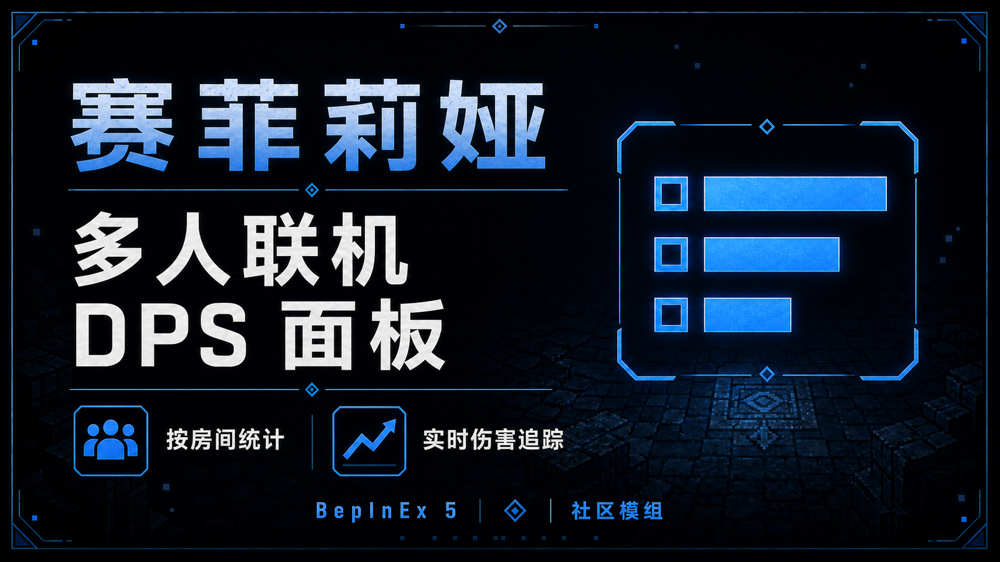
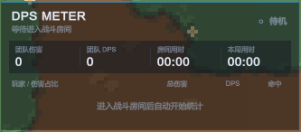
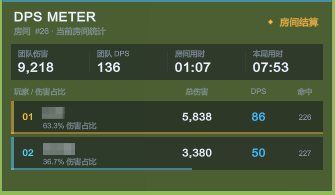
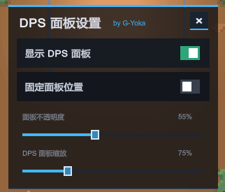
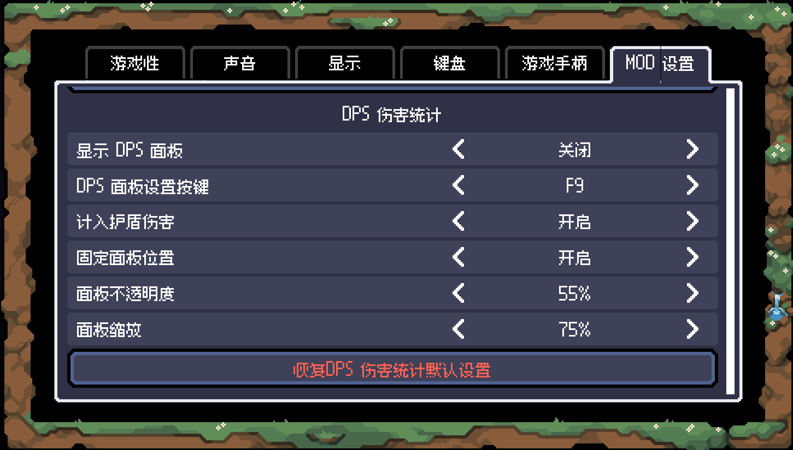

🌐 语言 / Language：[简体中文](README.md) · [English](README.en.md)

[](https://github.com/G-Yoka/SephiriaDpsMeter/releases/latest)
[](https://github.com/G-Yoka/SephiriaDpsMeter/releases)



《赛菲莉娅》（Sephiria）的 BepInEx 5 伤害统计插件。按房间记录玩家伤害、DPS 与占比，用一个可拖动、可缩放的悬浮面板查看团队输出表现。

- 当前版本：`v1.5.1`
- Steam AppID：[2436940](https://store.steampowered.com/app/2436940/Sephiria/)
- 运行环境：Windows / BepInEx 5 / Unity Mono
- 兼容性：`v1.5.1` 已通过编译、自动测试与游戏内测试（2026-08-28）；后续游戏更新需重新确认
- 联机方式：读取游戏原生 Mirror 伤害反馈，面向单机、联机房主与客户端

> 本项目使用 **BepInEx 5**，不是 BepInEx 6 或 IL2CPP 插件。请勿直接用其他模组的加载器完整包覆盖现有环境。

> **v1.5.1 已将繁体中文映射为简体中文界面。** 下列截图为中文界面示例。

## 截图

### DPS 悬浮面板

显示团队伤害、团队 DPS、房间用时、本局用时；战斗中在下方按伤害排序显示玩家。

<p>
  
  
</p>

### F9 独立设置菜单

面板开关、位置锁定、背景不透明度、缩放均可在游戏内调整。设置菜单自身的背景不透明度固定为 75%，文字与控件保持清晰。



### 可选：原生 MOD 设置入口

另行安装 [SephiriaModSettings](https://github.com/G-Yoka/SephiriaModSettings) 后，还可以从 `ESC → 选项 → MOD 设置` 调整 DPS 配置。它是独立模组，**不包含在本项目中，也不是运行必需项**。



> 截图展示的是自定义配置；例如 55% 不透明度、75% 缩放，并非首次安装的默认值。

## 功能

- **自动语言切换（v1.5.1）**：跟随游戏当前语言；简体中文（`zh-CN`）与繁体中文（`zh-TW`）均显示简体中文，其他语言显示英语。面板、状态提示与 F9 设置同步切换，无需重启，不重置统计；玩家名字保持原样。
- **按玩家统计**：显示总伤害、团队伤害占比、DPS 与命中计数，按伤害从高到低排列。
- **房间制统计**：结合本地玩家的战斗状态、楼层与战斗区域开始统计，脱离战斗后冻结结果；进入新的战斗房间或楼层时开始新一轮。
- **分房隔离**：只统计当前房间内玩家对房间内敌人造成的伤害；队友在同层其他房间或不同楼层战斗时，不会混入当前面板。
- **不使用空闲重置**：没有“若干秒未造成伤害就清零”的逻辑，战斗中的等待时间仍计入房间 DPS。
- **双计时**：分别显示房间战斗用时与游戏记录的本局游玩时间；整局结束时冻结本局时间，新局开始后更新。
- **伤害归属**：沿游戏的攻击者 / 主人关系查找玩家，将可识别的召唤物与持续伤害归到对应玩家。
- **自定义显示**：主面板背景不透明度支持 25%–100%，缩放支持 60%–120%；设置窗口不随主面板缩放。
- **位置锁定**：未锁定时拖动标题区域移动主面板，锁定后不能拖动；位置会在隐藏面板或插件正常卸载时保存。
- **多人列表**：超过 6 名有伤害记录的玩家时显示滚动区域。
- **轻量只读**：监听伤害反馈，不修改伤害、角色属性或存档，不发送额外的模组网络消息。
- **输入保持正常**：不拦截玩家的整帧输入更新或攻击回调，鼠标经过面板不会主动阻断键盘移动与左右键。

## 安装

### 下载

前往 [Releases 下载最新版](https://github.com/G-Yoka/SephiriaDpsMeter/releases/latest)，选择 `SephiriaDpsMeter-v1.5.1.zip` 插件安装包；也可只下载 `SephiriaDpsMeter.dll`。

安装包已按 `BepInEx/plugins/SephiriaDpsMeter.dll` 放好目录，**不包含 BepInEx 加载器**。GitHub 自动提供的 `Source code (zip)` / `Source code (tar.gz)` 是源码，不是可直接安装的插件。

### 已安装 BepInEx 5

1. 退出游戏，避免 DLL 正被游戏占用。
2. 从 [Releases](https://github.com/G-Yoka/SephiriaDpsMeter/releases/latest) 下载插件 ZIP 或 DLL，也可按下文从源码构建。
3. 在 Steam 库中右键《赛菲莉娅》→ 管理 → 浏览本地文件。
4. 使用 ZIP 时，将其中的 `BepInEx` 文件夹合并到游戏根目录；使用单独 DLL 时，将其放入 `BepInEx/plugins/`，如下所示。
5. 正常启动游戏，按 `F9` 打开设置菜单。

```text
Sephiria/
└── BepInEx/
    └── plugins/
        └── SephiriaDpsMeter.dll
```

### 尚未安装加载器

先按 [BepInEx 官方安装说明](https://docs.bepinex.dev/articles/user_guide/installation/index.html)安装适合游戏的 **BepInEx 5**，启动一次游戏，确认已生成 `BepInEx/plugins` 后，再安装本插件。

本项目不附带 BepInEx、游戏程序集或其他模组。若已有模组环境，先确认加载器版本，不要混装 BepInEx 5 与 6。

### 更新与卸载

- **更新**：退出游戏后覆盖同名 DLL，保留原配置；不要同时保留多个版本的插件 DLL。
- **卸载**：退出游戏后删除 `BepInEx/plugins/SephiriaDpsMeter.dll` 即可。无需删除其他模组或整个 BepInEx 目录。
- **重置配置**：退出游戏后备份并移走 `BepInEx/config/com.sephiriamods.dpsmeter.cfg`，下次启动会重新生成默认配置。

## 使用

1. 进入游戏，默认显示 DPS 面板；没有伤害记录时显示等待提示。
2. 进入战斗后自动开始统计，不需要手动点击“开始”。
3. 战斗结束后查看房间结算；下一轮战斗开始时清空上一轮数据。
4. 按 `F9` 打开 / 关闭设置菜单，可隐藏 DPS 面板、锁定位置、调整不透明度与缩放。
5. 未锁定时拖动 `DPS METER` 标题区域移动主面板。

打开 F9 设置时使用系统光标；关闭后恢复之前的光标可见性与锁定状态。设置菜单不暂停游戏，建议在安全区域调整；由于本插件不屏蔽游戏攻击输入，点击或拖动界面时也可能触发游戏操作。

### 界面语言（v1.5.1）

在游戏自己的语言设置中选择语言即可，插件不需要额外的语言配置项，也不根据 Windows 系统语言选择文案。

| 游戏语言 | DPS 面板与 F9 设置 |
| --- | --- |
| 简体中文（`zh-CN`） | 简体中文 |
| 繁体中文（`zh-TW`） | 简体中文 |
| English、한국어、日本語等其他语言 | English |
| 语言尚未初始化或无法识别 | English |

切换语言仅改变界面文案，不清空伤害排行、不重启房间或本局计时。独立模组 `SephiriaModSettings` 的原生设置页文案由该项目自身管理，不属于本插件 F9 窗口的翻译范围。

## 统计口径与联机说明

| 指标 | 计算方式 |
| --- | --- |
| 总伤害 | 当前房间战斗中，归属到该玩家且通过房间过滤的有效伤害反馈之和 |
| 团队伤害 | 面板中所有已记录玩家的总伤害之和 |
| 伤害占比 | 玩家总伤害 ÷ 团队伤害 |
| 玩家 / 团队 DPS | 对应总伤害 ÷ 当前房间战斗用时，而非仅造成伤害的时间 |
| 命中 | 每批伤害反馈中，每名玩家最多增加一次；不是出手次数、命中率或逐弹体命中数 |
| 房间用时 | 当前房间战斗的现实经过时间；脱离战斗后冻结，切换房间或楼层时另起一轮；房间无法识别时暂停统计 |
| 本局用时 | 读取游戏的 `playedRealtimeClientside`，按 `NetworkisRunStarted` 更新或冻结 |

- 只有想查看面板的玩家需要安装本插件；其他玩家不必仅为这个面板安装它。
- 房主和客户端都读取自己收到的游戏原生伤害反馈，不依赖本插件额外同步。
- **不是服务器全局战斗日志**：视野、网络同步范围、分房活动及游戏版本变化可能影响客户端收到的数据；不保证所有客户端显示完全一致。
- 玩家与可识别的玩家召唤物作为受击方时不计入输出；无法追溯到玩家的攻击者也不会显示。
- “房间”由本地玩家的楼层标识与游戏刷怪器提供的战斗区域共同确定，并结合 `IsInBattle` 控制开始与冻结；显示的房间编号是插件本次加载以来的统计轮次，不是地图房间 ID。
- 伤害所属玩家必须与本地玩家同层，且该玩家与受击目标都位于当前房间范围内。召唤物伤害同样检查其所属玩家；玩家离开房间后，留在旧房间的持续伤害不会跨房计入。
- 无法识别有效战斗区域时显示“等待识别当前战斗房间”并暂停计入伤害，不退回全局汇总。缺少原生房间区域的特殊战斗可能无法统计。
- v1.4.3 分房统计修复已实机测试通过（2026-08-27）。
- 当前不保存历史房间、跨重启统计或完整整局伤害榜；“本局用时”不代表整局伤害统计。

## 配置速查

首次加载后，配置文件位于：

```text
BepInEx/config/com.sephiriamods.dpsmeter.cfg
```

| 分区 | 配置项 | 默认值 | 说明 |
| --- | --- | --- | --- |
| Interface | Visible | true | 显示 DPS 主面板 |
| Interface | ToggleKey | F9 | 打开 / 关闭设置菜单，不是直接切换主面板 |
| Interface | LockWindowPosition | false | 固定主面板位置，禁止拖动 |
| Interface | PanelOpacity | 0.92 | 主面板背景透明度系数，支持 0.25–1.00 |
| Interface | PanelScale | 1.00 | 主面板缩放倍率，支持 0.60–1.20 |
| Interface | WindowX | 20 | 主面板左上角横坐标，单位为屏幕像素 |
| Interface | WindowY | 120 | 主面板左上角纵坐标，单位为屏幕像素 |
| Statistics | CountShieldDamage | true | 默认保留普通护盾与 MP 护盾伤害反馈；建议保持开启 |

游戏内设置即时生效并写回配置。手动编辑配置文件前请退出游戏，修改后重新启动。

> `CountShieldDamage=false` 在当前版本中按每批反馈保留首条有效记录，并不是逐条识别护盾类型的精确过滤。需要可比统计时请保持默认值。主面板的透明度系数也不影响固定为 75% 背景不透明度的设置窗口。

## 从源码构建

需要 Windows、游戏本体、已安装的 BepInEx 5，以及 .NET Framework C# 编译器。构建脚本使用 Windows 自带路径下的 `Framework64/v4.0.30319/csc.exe`，并引用本机游戏和 BepInEx 程序集，无需将这些 DLL 上传到仓库。

在项目根目录打开 PowerShell，传入自己的游戏路径：

```powershell
.\plugin\build.ps1 -GameDirectory 'D:\SteamLibrary\steamapps\common\Sephiria'
```

生成文件：`bin/SephiriaDpsMeter.dll`。

构建可分发的插件 ZIP 和校验文件：

```powershell
.\plugin\package.ps1 -GameDirectory 'D:\SteamLibrary\steamapps\common\Sephiria'
```

产物位于 `dist/`，包含版本化 ZIP、独立 DLL 和 `SHA256SUMS.txt`。打包脚本不会覆盖已有的同名 ZIP；新构建安装包中的说明位于 `docs/`，截图位于 `screenshots/`。

构建并安装到指定游戏目录（先退出游戏）：

```powershell
.\plugin\build.ps1 -GameDirectory 'D:\SteamLibrary\steamapps\common\Sephiria' -Deploy
```

也可在当前 PowerShell 会话设置环境变量：

```powershell
$env:SEPHIRIA_GAME_DIR = 'D:\SteamLibrary\steamapps\common\Sephiria'
.\plugin\build.ps1
```

仓库结构：

```text
SephiriaDpsMeter/
├── plugin/
│   ├── Plugin.cs
│   ├── RoomScope.cs
│   ├── MeterLocalization.cs
│   ├── build.ps1
│   └── package.ps1
├── docs/
│   ├── README.md
│   ├── README.en.md
│   ├── INSTALL.md
│   ├── CHANGELOG.md
│   └── releases/
├── screenshots/
└── .gitignore
```

## 工作原理

1. 使用 Harmony 监听 `UnitAvatar.UserCode_RpcShowAllDamageParticles__DamageFeedback[]`，不改变原方法的执行结果。
2. 将反馈中的攻击者沿 `NetworkLeader` 关系追溯到 `PlayerAvatar`，检查所属玩家楼层以及玩家、受击目标的房间范围，再按玩家网络 ID 累加伤害。
3. 结合本地玩家 `IsInBattle`、楼层与原生战斗区域决定统计的开始与冻结；伤害回调前也检查房间切换，不使用空闲超时。
4. 读取游戏本局计时及整局状态，由 Unity IMGUI 绘制面板与独立设置窗口。
5. 绘制时读取 `LocalizationManager.Instance.CurrentLanguage`，`zh-CN` 与 `zh-TW` 均使用简体中文，其余使用英语；不修改游戏语言或统计状态。

## 常见问题

**按 F9 没有反应？**

确认已安装 BepInEx 5，DLL 位于 `plugins` 中，配置中的 `ToggleKey` 未被更改。检查 `BepInEx/LogOutput.log` 是否有 `Sephiria Multiplayer DPS Meter v1.5.1 loaded` 或加载错误；其他模组也可能占用 F9。

**游戏改成英语，面板仍是中文？**

先确认已更新到 `v1.5.0` 或更新版本；旧版 `v1.4.3` 不包含双语界面。插件跟随游戏当前语言，而非系统语言；替换 DLL 后必须重新启动游戏，之后切换语言无需再重启。

**面板一直显示等待，或者没有队友的数据？**

先进入战斗并造成伤害。面板只显示当前房间内已收到有效伤害反馈的玩家；不同房间或楼层的队友不会计入，这是预期行为。客户端同步范围或版本不兼容也可能导致记录缺失，参见上面的联机说明。

如果显示“等待识别当前战斗房间”，说明暂未取得有效房间区域，插件会暂停计入伤害；若在普通战斗房间持续出现，请反馈所在房间类型及日志中的错误信息。

**安装或更新提示文件被占用？**

彻底退出游戏后再覆盖 DLL。正在运行的游戏不会自动加载刚替换的新版本。

**游戏更新后出现错误？**

插件依赖游戏内部类和方法，游戏更新可能影响兼容性。反馈时请附游戏版本、BepInEx 版本、插件版本、单机 / 房主 / 客户端身份及错误片段；发送日志前请删去私人路径、账号信息等无关内容。

## 致谢与说明

- 本插件为非官方项目，与游戏开发者无隶属关系。游戏、第三方加载器及依赖的权利归各自权利人所有，仓库不附带游戏程序集。
- 本插件不修改任何游戏文件，仅供学习与个人使用；使用本插件产生的任何后果由使用者自行承担。
